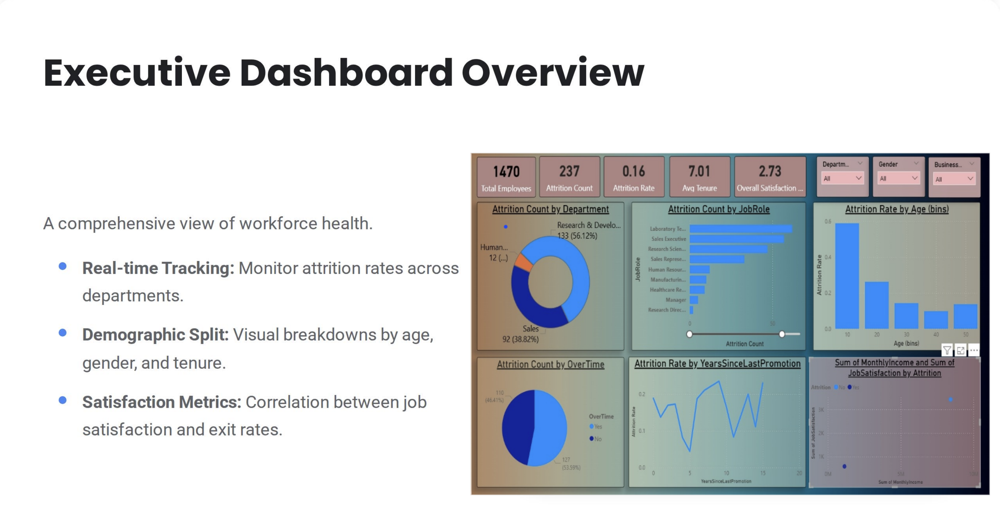
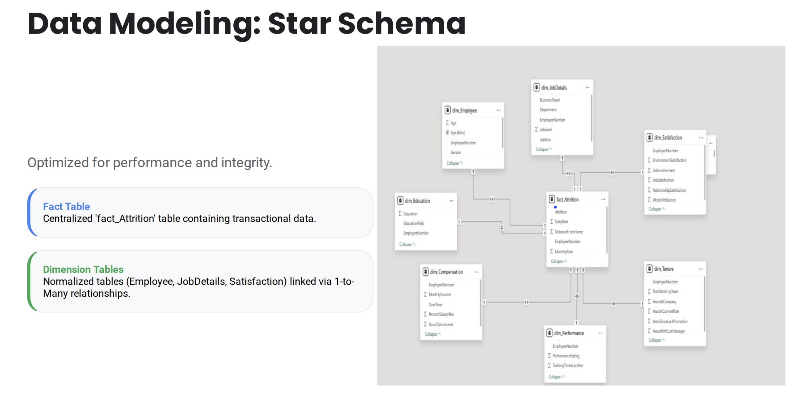

# HR Attrition Dashboard

A modern, interactive dashboard for analyzing HR attrition and employee turnover. This repository contains the code, datasets (if included), and assets needed to run and customize the dashboard for analysis and presentations.

[](https://www.linkedin.com/in/amit-kumar-c/)

---

## Table of Contents

- [About](#about)
- [Features](#features)
- [Screenshots](#screenshots)
- [Quick Start](#quick-start)
- [Project Structure](#project-structure)
- [Technologies](#technologies)
- [Contributing](#contributing)
- [License](#license)
- [Contact](#contact)

---

## About

This project provides a clean, modern dashboard to explore HR attrition data: visualizing trends, feature importance, demographic breakdowns, model performance, and interactive filters for exploratory data analysis.

Use it as a starting point for internal HR analytics, hiring forecasting, or demonstration projects.

## Features

- Interactive visualizations (charts, tables, KPI tiles)
- Filterable dashboards by department, tenure, performance, etc.
- Model outputs and interpretability (if model included)
- Exportable reports and screenshots
---
## Screenshots



*Figure 1 — Dashboard overview.*


*Figure 2 — Filter and KPI panel.*

---

## Quick Start

Follow these steps to run the dashboard locally.

1. Clone the repo

```bash
git clone https://github.com/PatelG108/HR_Attrition_Dashboard.git
cd HR_Attrition_Dashboard
```
## Technologies

This dashboard commonly uses:

- Python 3.8+
- pandas, numpy
- Seaborn, or Matplotlib for visualizations
- PowerBI
- MySQL
---
## Contact

Connect on LinkedIn:

[](https://www.linkedin.com/in/amit-kumar-c/)


---

Thank you for using the HR Attrition Dashboard
